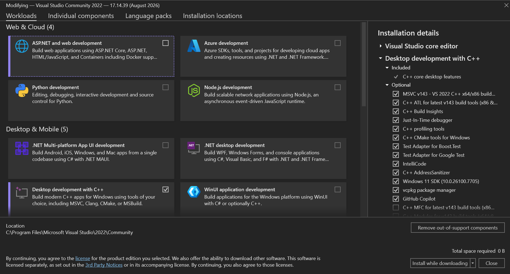

# Guide d'installation

Ce guide contient les instructions pour installer les dépendences nécessaires au fonctionnement du projet.

## OpenSim

1. Télécharger OpenSim 4.6 à partir de Teams: Robotique UdeS/BioGénius - Contrôle/Programmation/Simulation/OpenSim-4.6-win64.exe

2. Lancer l'installateur

3. Ajouter `C:\OpenSim 4.6\bin` au PATH. Voir [Comment modifier le PATH](#comment-modifier-le-path).

## Visual Studio

1. Télécharger la version la plus récente de Visual Studio Community: https://visualstudio.microsoft.com/downloads/

2. Lancer l'installateur

3. Sélectionner le *workload* "Desktop development with C++" et s'assurer que l'option "C++ CMake tools for Windows" est sélectionnée dans la barre de droite.

4. (Optionel) Pour CMake CLI, ajouter `C:\Program Files\Microsoft Visual Studio\2026\Community\Common7\IDE\CommonExtensions\Microsoft\CMake\CMake\bin` au PATH. Voir [Comment modifier le PATH](#comment-modifier-le-path).

# Comment modifier le PATH

1. Lancer "Edit the system environment variables" à partir de la barre de recherche Windows.
2. Aller dans l'onglet "Advanced"
3. Cliquer sur le bouton "Environment Variables..."
4. Sélectionner la variable "Path" sous "User variables for ..."
5. Cliquer sur le bouton "Edit"
6. Cliquer sur le bouton "New"
7. Entrer le chemin à ajouter
8. Cliquer sur le bouton "Ok" dans chacune des trois fenêtres pour sauvegarder et fermer
